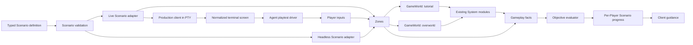

# Tutorial Scenario and Agent Playtest Loop

**Status:** Approved design

## Summary

Build one polished, five-to-ten-minute tutorial Scenario that moves a new Player from exploration into skilling. Use that vertical slice to deepen Termenor's existing simulation and content architecture only where the tutorial demonstrates a real need.

The tutorial is not a generic engine project. `GameWorld`, `Zones`, the existing System modules, server authority, 15 Hz Tick cadence, Snapshot replication, terminal renderer, and typed catalogs remain the foundation. The new substrate is deliberately thin:

1. a validated, typed Scenario definition;
2. a small vocabulary of authoritative gameplay facts;
3. a guided objective evaluator;
4. a headless Scenario adapter that drives the real `Zones` boundary deterministically;
5. a live adapter that drives the production server and client through a reusable PTY harness;
6. a layered agent driver combining semantic observations with the real terminal screen.

The first slice teaches movement, dialogue, Gather, Item processing, Inventory interaction, Skill progression, and Zone exit. Combat, banking, shops, Gear, and Standing Orders are follow-on tutorial scenarios, not initial branches.

## Product goal

A new Player should experience the opening as exploration leading naturally into skilling:

- discover a guide and a nearby objective through the world layout;
- learn click-to-move and click-to-act by doing;
- find and Gather a Resource;
- process the resulting Item using a real post-tutorial mechanic;
- see Inventory and Skill progression respond;
- leave the tutorial through the real Zone transition path.

The tutorial must feel like a compact part of the actual game, not a wizard, checklist overlay, or parallel tutorial-only ruleset.

### Success criteria

A first-time Player can finish in five to ten minutes. An experienced tester can replay it in under two minutes. By the exit, the Player has:

1. moved through the world and talked to an NPC;
2. found and gathered a Resource;
3. received an Item and Skill XP;
4. processed the Item through a normal action or Recipe;
5. performed one meaningful Inventory interaction;
6. observed Inventory and Skill feedback;
7. crossed into the ordinary overworld.

The development loop lets an agent start a known Scenario, perceive the real terminal, send keyboard and mouse input, wait on visible or authoritative conditions, diagnose failures with structured state, and retain reproducible artifacts.

## Existing foundation

The design preserves the parts of the prototype that already have depth and locality:

- `packages/server/src/game.ts::GameWorld` owns authoritative mutable state, injected RNG, fixed System order, commands, and Snapshots.
- `packages/server/src/zones.ts::Zones` owns one independent `GameWorld` per Zone, Player location, portal detection, and cross-Zone transfer.
- `packages/server/src/*-system.ts` modules contain movement, combat, Gather, Inventory, Resource, Recipe/action, Quest, Order, bank, shop, and equipment rules.
- `packages/protocol/src/*` catalogs describe Models, Items, NPCs, Resources, Recipes, Quests, and shops.
- `packages/server/src/world.ts::ZoneDef` already supplies two live adapters—overworld and cave—for Map, spawn, Scenery, NPCs, Resources, seed Items, and portals.
- `packages/protocol/src/intents.ts::Intent` and `packages/server/src/intent-executor.ts` provide a typed command vocabulary.
- `scripts/pty-render-check.py`, `scripts/pty-click-check.py`, and `scripts/pty-login-check.py` already launch the production server/client, isolate SQLite state, inject terminal input, and capture OpenTUI escape output.

The design repairs seams around these modules rather than replacing them.

## Approaches considered

### Extend Quest steps directly

Add enter-area, Gather, process-Item, gain-XP, and Inventory-action variants to `QuestStep`.

This is initially small, but it makes ordinary Quests carry tutorial orchestration, playtest assertions, replay evidence, and UI guidance. The existing Quest catalog has one Quest and supports only talk/deliver, so it is not yet a proven general progression seam. This approach would solve the content while leaving the requested agent playtest loop fragmented.

### Scenario-driven vertical slice — selected

Add a thin Scenario layer over the existing engine. The same Scenario definition feeds a live authoritative adapter and a fast headless adapter. The tutorial forces each new interface to prove leverage immediately.

This preserves server authority and existing Systems, creates a real two-adapter seam, and yields both authored progression and a closed agent playtest loop.

### General-purpose engine rewrite

Introduce ECS, arbitrary triggers, scripting, soft hot reload, replay infrastructure, and a visual editor before authoring the tutorial.

This is rejected. Current entity scale and profiling do not justify ECS. Existing domain-specific Systems already centralize invariants. A scripting language and live authoritative-state migration would increase interface surface and ambiguity before content volume proves a need.

## Canonical language

Add **Scenario** to `CONTEXT.md` during implementation:

> **Scenario**: A validated authored setup and guided objective sequence run over normal Zones, Systems, and catalogs. A Scenario chooses initial conditions and observes authoritative outcomes; it does not redefine game rules.

Avoid calling a Scenario a quest, level, mode, script, fixture, or tutorial engine. A headless test fixture is an adapter for a Scenario, not the Scenario itself.

Add **Gameplay Fact** if the implementation uses the term in exported interfaces:

> **Gameplay Fact**: An immutable record of a successful authoritative transition at one Tick, emitted in deterministic order for objective evaluation and diagnostics. It is not World state and cannot mutate the World.

## Architectural shape

Both adapters drive `Zones`, not a bare `GameWorld`. Portal detection, Player transfer, destination placement, and transition buffering live in `Zones.step`; bypassing it would prevent the headless path from proving the tutorial exit end to end.

## Module design

### `GameWorld` remains the simulation kernel

`GameWorld` continues to own authoritative Entities, fixed System ordering, RNG, Tick advancement, command methods, and Snapshot construction. No second simulation is introduced.

Deterministic headless execution strengthens explicit inputs:

- fixed Tick duration;
- injected seeded RNG;
- stable initial Scenario state;
- deterministic Entity identifiers;
- Tick-indexed scripted inputs;
- stable gameplay-fact ordering.

This does not change the network model. The production server remains authoritative and clients continue to send input and interpolate Snapshots.

### `Zones` is the Scenario execution boundary

A Scenario spans at least the tutorial Zone and destination overworld, so `Zones` is the smallest correct execution boundary. Scenario construction supplies:

- selected `ZoneDef[]`;
- Scenario identity/version;
- seeded RNG factory, producing a stable stream per Zone;
- stable Zone iteration order;
- Scenario progress/evaluator state.

Each outer Tick:

1. advances every Zone World once in stable order;
2. applies portal transitions after World advancement;
3. never advances a transferred Player twice;
4. emits transition facts in stable order;
5. evaluates affected Players' objectives;
6. exposes transitions and progress to transport/persistence adapters.

State digests include Zone identity and Player placement, not only individual `GameWorld` state.

### `ScenarioDef` describes authored facts, not rules

A typed, startup-validated Scenario definition contains:

- stable Scenario ID;
- content/schema version;
- participating Zone IDs or definitions;
- starting Zone and Player spawn;
- initial loadout/state overrides required by the Scenario;
- ordered guided objectives;
- concise objective/dialogue text;
- completion and exit condition.

The definition references stable catalog IDs. It does not implement movement, Gather, processing, Inventory, XP, portal, or reward algorithms. Those remain behind existing System interfaces.

Use typed TypeScript definitions and runtime validation, following the existing Model/catalog precedent. Do not add JSON authoring, arbitrary callbacks, or a scripting language in the first slice.

### Gameplay facts

Existing feature-specific queues, especially `GameEvents.gatherNotices`, do not provide a coherent progression seam. Successful authoritative mutations needed by the tutorial emit a small discriminated union:

- `playerTalked`;
- `resourceGathered`;
- `itemProduced`;
- `inventoryActionPerformed`;
- `skillXpGained`;
- `skillLevelGained`;
- `playerEnteredZone`;
- `scenarioExitCrossed`.

Every fact carries:

- outer Tick;
- sequence within the Tick;
- Player ID;
- relevant stable catalog IDs;
- minimal outcome data needed by consumers.

Facts are immutable and emitted only after successful mutations. Attempted actions that fail produce typed rejection feedback/trace entries but cannot satisfy objectives. Facts are not a global pub/sub bus, event store, replacement for Entity state, or mutation mechanism.

`itemProduced` identifies its source operation—such as Gather, Recipe, or action—so receiving the same Item from an unrelated grant cannot satisfy the tutorial.

### Objective evaluator

The first evaluator supports an ordered objective list with retained evidence. It is not an arbitrary graph or Boolean trigger language.

Each objective has:

- stable objective ID;
- concise Player-facing guidance;
- typed completion predicate over gameplay facts;
- optional explicit World predicate for state that must remain true;
- persistence policy;
- next objective.

Valid early actions count when sensible. For example, a Player who gathers logs before speaking to the guide retains that evidence; after the dialogue objective completes, the Gather objective may advance immediately. A processing objective may still require that usable logs are currently present.

One fact may satisfy multiple compatible predicates, but each objective transitions once. Repeated actions never duplicate completion or rewards. Another Player's facts never advance this Player's progress.

### Scenario progress on the wire

The client needs authoritative current guidance. Add a narrow Scenario-progress message or equivalent authoritative field containing only:

- Scenario ID/version;
- current objective ID and text;
- completed status;
- latest transition feedback when needed.

Do not send the full fact history or evaluator internals. The Quest tab may show progress, while the main HUD shows one compact current-objective line. This must not recreate the previous permanent text wall over the world.

## Tutorial experience

### Region layout

The tutorial is one compact, nonlethal Zone with three spatial beats.

#### Arrival clearing

The Player appears near a visible guide and recognizable path. The first objective is to reach and talk to the guide. Dialogue establishes one immediate goal in a few lines. Movement and clicking are learned through action rather than a modal instruction page.

#### Gathering grove and work area

A required Resource is discoverable from an intermediate landmark but need not be visible from spawn. Clicking it exercises normal movement, adjacency, tool, Gather cooldown, Item award, and XP rules. Nearby work Scenery exposes a real processing action or Recipe used after the tutorial.

#### Exit overlook

The route loops toward an exit guide and portal. The guide acknowledges authoritative accomplishments. Crossing the portal is allowed only after required objectives are complete and places the Player in the ordinary overworld.

World composition, contrast, landmarks, and short sightlines carry navigation. Objective text is backup guidance, not the primary navigation system.

### Mandatory journey

1. Move from spawn and talk to the guide.
2. Explore to locate the Resource.
3. Gather it through click-to-act.
4. Receive an Item and Skill XP.
5. Process the Item through a normal action.
6. Perform one meaningful Inventory interaction.
7. Observe Inventory and Skill feedback.
8. Return to the exit and cross into the overworld.

The journey is guided rather than strictly gated. The UI presents one current objective, while valid early evidence is retained.

### Feedback hierarchy

Each objective uses three layers:

1. **World affordance:** placement, path, landmark, Resource silhouette, Scenery, and exit location.
2. **Persistent objective line:** one short, action-oriented sentence.
3. **Transition feedback:** brief confirmation of the action and resulting progression.

Rejected actions report the real blocker: missing tool, full Inventory, wrong target, inaccessible route, or incomplete objective.

### Recovery

The tutorial must resist soft locks:

- required Resources respawn through normal rules;
- dropped or consumed required Items can be reacquired;
- full Inventory produces actionable feedback;
- reconnect restores Player and Scenario progress;
- there is no lethal encounter in the first slice;
- premature exit communicates the next objective;
- multiplayer credit is per Player;
- shared Resource availability/respawn prevents another Player from permanently blocking progress;
- incompatible Scenario versions reset or migrate only tutorial progress, never unrelated Player state.

### Completion

The Scenario completes when the authoritative evaluator has evidence that the Player talked to the guide, gathered the Resource, processed the Item, performed the Inventory interaction, received intended Skill progression, and then crossed the exit.

Portal crossing is the final committed transition. Completion persistence and destination placement are atomic from the Player's perspective: no completed tutorial while stranded on the island, and no overworld arrival without completion persisted.

## Input ordering and determinism scope

A full migration of every WebSocket action onto a next-Tick queue is explicitly **not part of this vertical slice**.

Today, server callbacks mutate `GameWorld` immediately. Converging movement, combat, Gather, bank, shop, equipment, and every legacy action in one change would alter all shipped input ordering and add up to one Tick—approximately 66 ms—of latency. The tutorial does not exercise enough of those systems to defend that server-wide regression surface.

The first slice therefore defines determinism at two levels:

### Headless adapter: reproducible

The headless Scenario runner schedules normalized inputs against explicit outer Tick numbers and drives `Zones.step` directly. Same Scenario version, seed, initial state, and input trace must produce identical facts, progress, transitions, and state digests.

### Live PTY adapter: faithful and condition-driven

The live adapter uses the production server callback semantics unchanged. It drives the real client and waits for visible or authoritative conditions rather than sleeping fixed durations. It records the Tick at which each outcome was observed, but exact replay across process scheduling is not promised in this slice.

A later input-queue slice may converge all client messages onto deterministic Tick-boundary intake. That slice must cover every shipped action path, compare legacy/Intent behavior, measure the added sub-Tick latency, and explicitly decide whether the latency is acceptable. It must not ride unnoticed inside tutorial work.

## Zone transfer

Current portal transfer uses persistence-shaped `RestoredState`, which incidentally heals Players and resets Orders, targets, paths, and cooldowns. Introduce a distinct simulation-transfer operation or state shape.

The operation must:

- preserve all state intended to survive Zone crossing;
- preserve HP rather than healing incidentally;
- explicitly cancel only actions invalid in the destination Zone;
- atomically remove the Player from the source and add them to the destination;
- reset the transport AOI baseline;
- emit `playerEnteredZone` and `scenarioExitCrossed` facts;
- persist Scenario completion and destination together for the tutorial exit.

The implementation must specify and test which transient actions survive or cancel. It must not use the persistence shape as an undocumented transfer policy.

## Persistence

Persist only:

- active Scenario ID;
- Scenario content/schema version;
- completed objective IDs;
- compact retained evidence needed by incomplete objectives;
- completion status.

Do not persist the entire gameplay-fact history, terminal observations, animation state, or replay artifacts as Player state.

On reconnect, reconstruct current guidance from persisted progress and authoritative Player state.

Version mismatch is explicit. Compatible copy/layout changes may retain progress. Semantic objective changes require a declared migration or reset of Scenario progress. Never discard unrelated Player state as fallback behavior.

## Agent playtest loop

### Reusable PTY harness

Extract the duplicated lifecycle mechanics from the three PTY verification scripts into one reusable harness. It owns:

- temporary SQLite creation and cleanup;
- free port allocation;
- real server subprocess startup;
- readiness polling through the existing HTTP response;
- real production client startup in a fixed-size PTY;
- server/client log capture;
- keyboard and SGR mouse input;
- terminal-screen reconstruction;
- semantic/visible waits and timeouts;
- teardown in all outcomes;
- failure artifacts.

Existing login, render, and click checks become scenarios on the harness; their low-level contracts remain covered.

### Layered driver

#### Semantic layer

Used for fast diagnosis and reliable control:

- inspect current Scenario/objective state;
- inspect visible authoritative entities and stable IDs;
- wait for authoritative conditions;
- record Tick-indexed observations;
- run headless scenarios at accelerated speed.

Semantic state is a diagnostic oracle, not a substitute for Player-facing validation.

#### PTY ground-truth layer

Used to validate the actual experience:

- reconstruct the current terminal cell grid;
- expose visible text and color spans;
- send keyboard input;
- click terminal cells through SGR mouse sequences;
- capture before/after normalized screens;
- retain raw escape bytes for low-level rendering contracts.

For Player-facing acceptance, actions enter through the production client. Direct `Connection.send*` calls may arrange observers or test protocol contracts, but do not prove discoverability or interaction UX.

### Restart policy

Use clean hard restart as the default iteration primitive:

- server/shared-content changes restart the authoritative process;
- the existing client reconnect behavior handles server restart;
- client/render changes restart the PTY client under the harness supervisor;
- fresh mode uses isolated temporary state;
- persistence mode retains the temporary Scenario database across restarts.

Do not soft-reload occupied authoritative Worlds. Soft reload risks stale Entity state, duplicate timers, and content-version ambiguity.

### Failure artifacts

Every failed scenario retains:

- Scenario ID/version and RNG seed;
- headless input trace where applicable;
- periodic Zone/World state digests;
- server and client logs;
- normalized before/after terminal screens;
- raw PTY stream when relevant;
- action timeline;
- objective progress and last rejection;
- elapsed phase timings.

## Validation

Fail Scenario startup before accepting Players when:

- Scenario or objective IDs are duplicated;
- referenced Zones, NPCs, Resources, Items, Skills, Recipes, Models, or destinations do not exist;
- spawn or exit tiles are out of bounds, blocked, or inconsistent with portal definitions;
- required Resource/Scenery placements are missing;
- objective predicates reference unsupported facts;
- required Items cannot be reacquired;
- objective ordering cannot reach completion;
- Scenario version is missing;
- a portal points to a missing Zone or invalid destination tile.

Validation stays narrow to authored integrity. It does not attempt to prove that a level is fun or that every route is navigable under every dynamic state.

## Error handling

- Unknown or malformed Scenario content fails server startup with the exact Scenario/objective/reference path.
- Rejected Player actions produce typed reasons suitable for both visible feedback and traces.
- Objective evaluation errors fail the affected Scenario explicitly; they do not silently skip progression.
- Persistence write failure prevents the final exit commit and tells the Player to retry; it must not report completion first.
- PTY harness startup failure surfaces server/client logs rather than timing out with empty output.
- All harness processes, PTYs, ports, and temporary directories are cleaned in `finally`-equivalent teardown; artifacts are copied to a retained failure directory before cleanup.
- A semantic observation may diagnose a failure, but a missing terminal-visible result still fails a Player-facing contract.

## Verification

### Headless contracts

- Same Scenario, version, seed, and Tick-indexed input trace yields identical facts, progress, transitions, and state digests.
- Both tutorial and destination Zones advance in stable order.
- A transferred Player advances at most once per outer Tick.
- Early valid actions are retained and credited later.
- Failed actions never satisfy objectives.
- Repeated facts do not duplicate completion or rewards.
- Required Items can be reacquired.
- Full Inventory produces an actionable rejection and recoverable path.
- Disconnect/reconnect restores guidance and progress.
- Exit crossing happens once and through `Zones.step`.
- Completion persistence and overworld placement behave atomically at the observable interface.
- Zone transfer preserves or intentionally cancels every tested state field.
- Another Player cannot advance or permanently block this Player's tutorial.
- Invalid authored references fail startup validation.

### Real-client PTY contracts

- Fresh Player sees the guide and current objective.
- World click moves the Player.
- Clicking the Resource starts normal Gather behavior.
- Inventory and Skills visibly reflect progress.
- Processing is reachable through the intended UI.
- Objective feedback remains legible at supported terminal dimensions.
- Premature exit communicates the next action.
- Completion reaches the ordinary overworld.
- Keyboard fallback remains usable.
- ASCII tier is playable and half-block tier remains correct.
- Existing login, render, and click verification behavior survives harness consolidation.

### Qualitative playtests

Automation cannot establish comprehension or fun. Record alongside traces:

- hesitation points;
- whether the next landmark was discoverable;
- repeated or rejected interactions;
- traversal time between beats;
- objective completion time;
- whether feedback explained causality;
- whether exploration felt discovered rather than dictated.

## Performance policy

Do not rewrite architecture based on assumed performance problems. Instrument the playtest loop first:

- server readiness;
- client authentication readiness;
- first world frame;
- action-to-authoritative-result;
- action-to-visible-feedback;
- server Tick duration;
- renderer frame duration/repaint count;
- bytes per rendered frame;
- Scenario completion duration.

Profile only when a measured budget is missed. Spatial queries, Snapshot allocation, and terminal repaint cost remain hypotheses until observed. ECS and data-layout migration are deferred.

## Explicit non-goals

- ECS migration.
- Lockstep networking, rollback, or client-side authoritative simulation.
- Full WebSocket input-queue migration.
- Arbitrary content scripting or trigger DSL.
- JSON Scenario authoring.
- Soft hot reload of live Worlds.
- Visual content editor.
- Production analytics platform.
- Combat, death, bank, shop, Gear, or Standing Order tutorial branches.
- Broad Quest redesign.
- Tutorial-only verbs, boosted mechanics, or duplicate Systems.

## Research basis

The design follows these source-backed principles:

- Server authority remains distinct from deterministic replay: [Roblox server authority](https://create.roblox.com/docs/projects/server-authority) and [Factorio deterministic lockstep](https://www.factorio.com/blog/post/fff-302).
- Replay requires explicit input and nondeterminism: Brian Provinciano, [*8 Years of QA Data in 8 Seconds*](https://www.youtube.com/watch?v=W20t1zCZv8M), and [Factorio desynchronization reports](https://factorio.com/blog/post/fff-188).
- Small headless scenarios are effective automated units: [Minecraft GameTest](https://learn.microsoft.com/en-us/minecraft/creator/documents/gametestgettingstarted?view=minecraft-bedrock-stable), [Factorio integration tests](https://factorio.com/blog/post/fff-60), and [Unity headless mode](https://docs.unity3d.com/Manual/desktop-headless-mode.html).
- Authored data should remain separate from game rules: [Unity ScriptableObject](https://docs.unity3d.com/6000.5/Documentation/Manual/class-ScriptableObject.html) and [Unreal Gameplay Tags](https://dev.epicgames.com/documentation/en-us/unreal-engine/using-gameplay-tags-in-unreal-engine).
- Tutorial microcosms should rehearse real interactions and combine telemetry with observation: Jagex, [*New Player Improvements—2025 and Beyond*](https://secure.runescape.com/m=news/new-player-improvements---2025-and-beyond?oldschool=1).
- Clean restart is safer than soft reload for stateful authoritative simulation: [Bun watch mode](https://bun.sh/docs/runtime/watch-mode) and [Defold hot reload](https://www.defold.com/manuals/hot-reload/).

## Acceptance boundary

This design is complete when the implementation plan can divide work into demonstrable vertical increments while preserving one end-to-end acceptance path:

> Start a fresh tutorial Scenario through the reusable harness; inspect the production terminal; click through movement, dialogue, Gather, Item processing, Inventory interaction, and Skill feedback; cross the real portal through `Zones`; arrive in the overworld with completion persisted; replay the same authored Scenario headlessly with deterministic results; retain actionable artifacts for any failed step.
